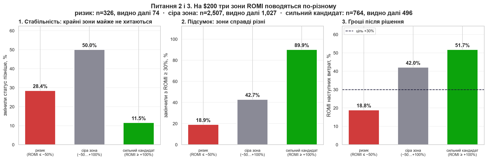

# Фреймворк тестування креативів — OBRIO / Nebula

Розвʼязання кейсу **Genesis Analytics Camp 3.0, Case #4** (Marketing Analytics).
Автор кейсу — Олександра Рижова, Marketing Analytics Lead @ OBRIO.

**Задача:** побудувати єдину систему оцінки тестів креативів замість двох антипатернів —
рішення на малих обʼємах (нестабільно) і очікування до `$2 000` спенду (точно, але повільно
й дорого).

---

## Головна ідея за 30 секунд

Надійно передбачити результат окремого креативу на ранніх витратах **не можна**, і збільшення
обсягу цього не лікує: навіть після `$2 000` витрат статус креативу відносно цілі `+30%`
ще змінюється у **23,8%** випадків.

Тому фреймворк відповідає не на питання «хто переможець?», а на питання
**«яку наступну обмежену суму дати цьому креативу і коли оцінити його знову?»**

| момент | що бачимо | дія |
|---|---|---|
| до **$50** | будь-який ROMI | ефективність не оцінюємо — лише технічна справність |
| **$50** | `ROMI ≤ −50%` | обережно до `$100` + ручна перевірка |
| **$50** | `ROMI > −50%` | ведемо до `$200` |
| **$200** | `ROMI ≥ +100%` | пріоритет бюджету до `$500` |
| **$200** | `−50% < ROMI < +100%` | один вимірюваний крок до `$300` |
| **$200** | `ROMI ≤ −50%` | у пілоті випадково 50/50: пауза або крок до `$250` |
| **$300** | ROMI частини `$200→$300` `≥ 30%` | у чергу до `$500`, інакше пауза |
| **$500** | будь-який | автоматичне правило завершується |

Бюджет видається як `max(0, ціль − уже витрачено)`, а не як «+$N»: дані денні, тому
в момент першого перетину `$50` медіанні фактичні витрати вже `$76`.

---

## Відповіді на пʼять питань кейсу

| # | питання | відповідь | де |
|---|---|---|---|
| 1 | Чи є мінімальний поріг? | **$50.** Виведено з даних: на `$25` у **35,7%** креативів ще немає жодної події, тому `ROMI = −100%` означає відсутність даних, а не поганий креатив. На `$50` таких 19,6%, на `$100` — 6,3%. | розділ 5.2 |
| 2 | Як ідентифікувати очевидні випадки і як часто вони змінюють статус? | На `$200` за зоною ROMI. `≥ +100%` — сильний: змінює статус лише у **11,5%**, 89,9% закінчують вище цілі. `≤ −50%` — ризиковий: **28,4%**. Середнє по всіх, хто дійшов, — **37,0%**. | розділ 5.3 |
| 3 | Що робити з неоднозначними і де максимум? | Сіра зона `−50…+100%` — це **70%** креативів і **50,0%** змін статусу, тобто майже монета → один крок до `$300`. Максимум — **$500**, і він обґрунтований **ціною, а не точністю**: суми, після якої рішення стає надійним, у цих даних не існує. | розділи 5.1, 5.3, 9 |
| 4 | Чи відрізняються метрики й обʼєми за розрізами? Чому? | Так, за механікою. Ціна однієї події гуляє від **$1,83 до $16,10** між темами (×8,8), тому однакові `$200` купують від 12 до 109 подій. Але пороги на старті лишаємо спільними — сегментних даних поки замало. | розділ 12.1 |
| 5 | Як виміряти, що фреймворк працює? | Випадковий тест **50/50** з рівними бюджетами, прибуток за **14 днів**, рішення за нижньою межею довірчого інтервалу. Розкид `$1 201` при медіані `$0` → 9 046 на групу; знижуємо його кластерами й CUPED. | розділи 13, 13.1, 13.2 |

---

## Ключові графіки

**Мінімальний поріг виводиться з даних**


**Три зони на $200 поводяться зовсім по-різному**



**Однакова сума купує різну кількість інформації**


**Обсяг не робить рішення надійним**


---

## Структура репозиторію

```
deck/        презентація для стейкхолдерів — 22 слайди, 8 графіків, 7 таблиць
notebooks/   відтворюваний аналіз, 16 розділів, 44 розрахункові комірки
report/      той самий аналіз у HTML без коду — відкривається у браузері
output/      figures/ — 16 графіків;  deck_data.json — числа, з яких зібрано деку
powerbi/     теми оформлення + інструкція зі збірки дашборда
data/        вхідні дані
build/       скрипти складання презентації
```

### З чого почати

1. **`deck/01_OBRIO_creative_testing_framework.pptx`** — уся відповідь на кейс.
   Документ самодостатній: висновки, правила, обмеження й план перевірки на слайдах.
2. **`report/02_analysis_report.html`** — обґрунтування з таблицями й графіками, без коду.
   Завантажте файл і відкрийте локально (GitHub не рендерить HTML у превʼю).
3. **`notebooks/02_analysis_notebook.ipynb`** — повний хід думки. GitHub рендерить
   ноутбук прямо у браузері; на початку є маршрут читання й таблиця
   «питання кейсу → розділ → ключові цифри».

---

## Відтворення

```bash
pip install -r requirements.txt
jupyter nbconvert --to notebook --execute --inplace notebooks/02_analysis_notebook.ipynb
```

Запускати з кореня репозиторію. Ноутбук прочитає `data/creo_framework_data.csv`,
збереже графіки в `output/figures` і числа в `output/deck_data.json`.
Поточна збережена версія виконана повністю: **44 розрахункові комірки, 0 помилок**.

Перезібрати презентацію після перерахунку:

```bash
node build/make_deck.cjs && python build/fix_charts.py && python build/dedupe_media.py
```

**Жодне число в презентації не введене руками.** Розділ 16 ноутбука експортує всі показники
в `output/deck_data.json`, а `build/make_deck.cjs` збирає деку з цього файлу — розсинхронізувати
аналіз і слайди технічно неможливо.

---

## Power BI

`powerbi/` містить дві теми оформлення на основі справжніх дизайн-токенів obrio.co
і детальну інструкцію зі збірки дашборда на двох сторінках — див.
[`powerbi/README.md`](powerbi/README.md).

Кольори зсунуті по світлості так, щоб пройти перевірки доступності: брендова аква `#77E5E9`
на білому тлі дає контраст лише **1,6 : 1**, тому світла тема використовує глибші кроки тих
самих відтінків. Обидві палітри перевірені: контраст ≥ 3 : 1, розрізнення сусідніх кольорів
для дальтонізму ΔE ≥ 8.

---

## Чого ця робота не стверджує

Це найважливіший розділ — без нього фреймворк був би небезпечним.

- **Не доведено, що правила заробляють гроші.** Історичний результат видно лише для
  креативів, яким у минулому вже дали бюджет. Це селективна розмітка, а не випадкова вибірка.
- **Не пропонується автоматичне вимкнення.** Наступні гроші ризикової зони окупаються
  під 18,8% — нижче цілі, але це прибуток. Право вимикати дає лише експеримент.
- **Пороги `−50%`, `+100%`, `$50`, `$200`, `$500` — кандидати для перевірки**, а не
  універсальні константи.
- **Дохід у даних прогнозований** (`predict_net_revenue` — це pLTV), а не отриманий.
- **Семантика поля `trials` не підтверджена**: усі ненульові значення кратні 16, причину
  автор кейсу не назвала. Тому ніде в роботі це число не називається кількістю оплат.

---

## Дані

`data/creo_framework_data.csv` — 197 127 рядків, грануляція «креатив × день»,
70 140 креативів, 01.08.2025 – 19.03.2026, джерело трафіку `meta`.
Значення в наборі змінені для навчальних цілей.
