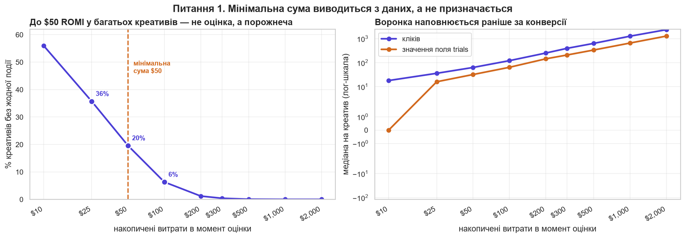
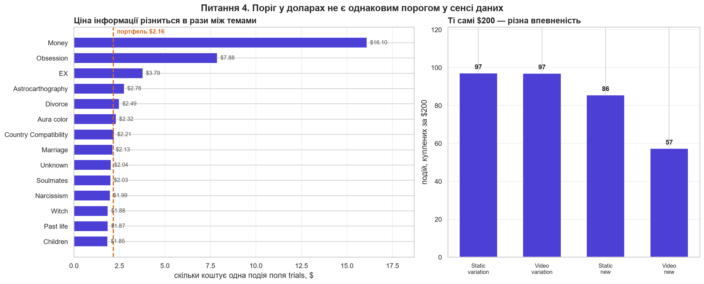
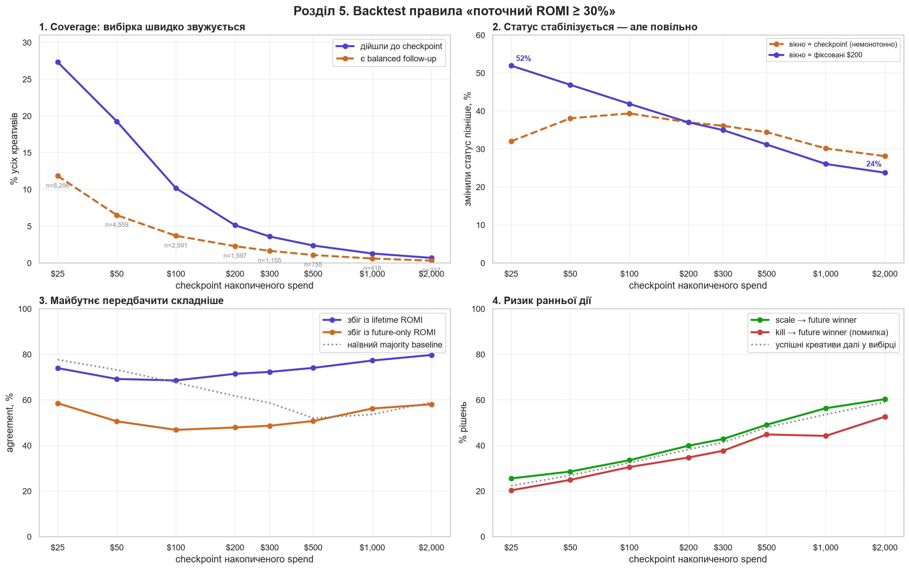

# Фреймворк тестування креативів — OBRIO / Nebula

Розвʼязання кейсу **Genesis Analytics Camp 3.0, Case #4** (Marketing Analytics).
Як приймати рішення по креативу швидко й обґрунтовано, не чекаючи `$2 000` спенду.

---

## З чого почати

Файли пронумеровані в порядку читання. Відкривайте зверху вниз — або тільки перший, якщо часу мало.

| # | файл | що це | як відкрити | час |
|---|---|---|---|---|
| **1** | [`1_Презентація.pptx`](1_Презентація.pptx) | **Головна відповідь на кейс.** 22 слайди, 8 графіків, 7 таблиць. Документ самодостатній: висновки, правила, обмеження й план перевірки — прямо на слайдах. | GitHub не показує `.pptx` у превʼю → натисніть **Download raw file** і відкрийте в PowerPoint | 10 хв |
| **2** | [`2_Аналіз_у_браузері.html`](2_Аналіз_у_браузері.html) | Усе обґрунтування: таблиці, графіки, пояснення — **без жодного рядка коду**. | GitHub не рендерить HTML → **Download raw file**, потім подвійний клік (відкриється у браузері) | 20 хв |
| **3** | [`3_Аналіз_ноутбук.ipynb`](3_Аналіз_ноутбук.ipynb) | Той самий аналіз, але з кодом. 16 розділів, 44 розрахункові комірки. | **Відкривається прямо тут, у GitHub** — просто клікніть | скільки не шкода |

> **Якщо є лише 5 хвилин:** відкрийте презентацію і подивіться слайди 5, 7 і 16 —
> мінімальний поріг, три зони рішення й підсумок.

### Що в теках

| тека | що всередині |
|---|---|
| [`data/`](data/) | вхідні дані + `deck_data.json` — усі числа, з яких зібрано презентацію |
| [`figures/`](figures/) | 16 графіків у PNG, якщо потрібні окремо |

---

## Головна ідея за 30 секунд

Надійно передбачити результат окремого креативу на ранніх витратах **не можна**, і збільшення
обсягу цього не лікує: навіть після `$2 000` витрат статус креативу відносно цілі `+30%`
ще змінюється у **23,8%** випадків.

Тому фреймворк відповідає не на питання «хто переможець?», а на питання
**«яку наступну обмежену суму дати цьому креативу і коли оцінити його знову?»**

| момент | що бачимо | дія |
|---|---|---|
| до **$50** | будь-який ROMI | ефективність не оцінюємо — лише технічна справність |
| **$50** | `ROMI ≤ −50%` | обережно до `$100` + ручна перевірка |
| **$50** | `ROMI > −50%` | ведемо до `$200` |
| **$200** | `ROMI ≥ +100%` | пріоритет бюджету до `$500` |
| **$200** | `−50% < ROMI < +100%` | один вимірюваний крок до `$300` |
| **$200** | `ROMI ≤ −50%` | у пілоті випадково 50/50: пауза або крок до `$250` |
| **$300** | ROMI частини `$200→$300` `≥ 30%` | у чергу до `$500`, інакше пауза |
| **$500** | будь-який | автоматичне правило завершується |

Бюджет видається як `max(0, ціль − уже витрачено)`, а не як «+$N»: дані денні, тому
в момент першого перетину `$50` медіанні фактичні витрати вже `$76`.

---

## Відповіді на пʼять питань кейсу

| # | питання | відповідь | розділ ноутбука |
|---|---|---|---|
| 1 | Чи є мінімальний поріг? | **$50.** Виведено з даних: на `$25` у **35,7%** креативів ще немає жодної події, тому `ROMI = −100%` означає відсутність даних, а не поганий креатив. На `$50` таких 19,6%, на `$100` — 6,3%. | 5.2 |
| 2 | Як ідентифікувати очевидні випадки і як часто вони змінюють статус? | На `$200` за зоною ROMI. `≥ +100%` — сильний: змінює статус лише у **11,5%**, 89,9% закінчують вище цілі. `≤ −50%` — ризиковий: **28,4%**. Середнє по всіх, хто дійшов, — **37,0%**. | 5.3 |
| 3 | Що робити з неоднозначними і де максимум? | Сіра зона `−50…+100%` — це **70%** креативів і **50,0%** змін статусу, тобто майже монета → один крок до `$300`. Максимум — **$500**, обґрунтований **ціною, а не точністю**: суми, після якої рішення стає надійним, у цих даних не існує. | 5.1, 5.3, 9 |
| 4 | Чи відрізняються метрики й обʼєми за розрізами? Чому? | Так, за механікою. Ціна однієї події гуляє від **$1,83 до $16,10** між темами (×8,8), тому однакові `$200` купують від 12 до 109 подій. Пороги на старті лишаємо спільними — сегментних даних поки замало. | 12.1 |
| 5 | Як виміряти, що фреймворк працює? | Випадковий тест **50/50** з рівними бюджетами, прибуток за **14 днів**, рішення за нижньою межею довірчого інтервалу. Розкид `$1 201` при медіані `$0` → 9 046 на групу; знижуємо його кластерами й CUPED. | 13, 13.1, 13.2 |

---

## Ключові графіки

**Мінімальний поріг виводиться з даних, а не призначається**



**Три зони на $200 поводяться зовсім по-різному**


**Однакова сума купує різну кількість інформації**



**Обсяг не робить рішення надійним**



---

## Якщо хочете перерахувати все з нуля

**Потрібно:** Python 3.12+ і бібліотеки з `requirements.txt`.

```bash
pip install -r requirements.txt
jupyter nbconvert --to notebook --execute --inplace "3_Аналіз_ноутбук.ipynb"
```

Запускати **з кореня репозиторію**. Ноутбук прочитає `data/creo_framework_data.csv`,
перерахує всі таблиці, збереже 16 графіків у `figures/` і всі числа презентації
в `data/deck_data.json`. Поточна збережена версія виконана повністю:
**44 розрахункові комірки, 0 помилок**.

**Жодне число в презентації не введене руками.** Розділ 16 ноутбука експортує всі показники
в `data/deck_data.json`, і презентація збирається саме з цього файлу — розсинхронізувати
аналіз і слайди неможливо. Будь-яку цифру зі слайда можна знайти в JSON і перевірити.

---

## Чого ця робота не стверджує

Найважливіший розділ — без нього фреймворк був би небезпечним.

- **Не доведено, що правила заробляють гроші.** Історичний результат видно лише для
  креативів, яким у минулому вже дали бюджет. Це селективна розмітка, а не випадкова вибірка.
- **Не пропонується автоматичне вимкнення.** Наступні гроші ризикової зони окупаються
  під 18,8% — нижче цілі, але це прибуток. Право вимикати дає лише експеримент.
- **Пороги `−50%`, `+100%`, `$50`, `$200`, `$500` — кандидати для перевірки**, а не
  універсальні константи.
- **Дохід у даних прогнозований** (`predict_net_revenue` — це pLTV), а не отриманий.
- **Семантика поля `trials` не підтверджена**: усі ненульові значення кратні 16, причину
  автор кейсу не назвала. Тому ніде в роботі це число не називається кількістю оплат.

---

## Дані

`data/creo_framework_data.csv` — 197 127 рядків, грануляція «креатив × день»,
70 140 креативів, 01.08.2025 – 19.03.2026, джерело трафіку `meta`.
Значення в наборі змінені для навчальних цілей.
